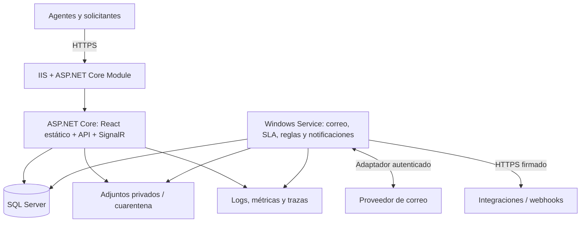

# Sidecil Tickets — Arquitectura propuesta

Fecha: 23 de septiembre de 2026. Estado: diseño inicial, pendiente de validar capacidad e integraciones con Sidecil. Este documento define la solución objetivo. La primera implementación parcial y sus límites están descritos en README.md; no todas las capacidades de esta arquitectura están implementadas.

## 1. Decisión principal

Construir una aplicación propia con **ASP.NET Core / .NET 10 LTS en IIS, SQL Server y React con TypeScript**. Usar un monolito modular con dos procesos desplegables: aplicación web/API y servicio de Windows para trabajos en segundo plano. Ambos comparten módulos de negocio y una base SQL Server.

Esto facilita operar en infraestructura Windows, mantener transacciones consistentes y evolucionar por módulos. Extraer servicios separados únicamente cuando existan necesidades medidas de escala, aislamiento o equipos independientes.

Supuestos iniciales:

- Sidecil será la empresa operadora. Alcance confirmado por el usuario: atención a empleados y clientes externos, con acceso separado.
- Las organizaciones de clientes agrupan solicitantes; no son instancias independientes del producto. Un SaaS para múltiples empresas operadoras requeriría revisar el aislamiento.
- Interfaz en español, fechas almacenadas en UTC y presentadas según zona horaria; predeterminado America/Bogota.
- Canales iniciales: portal web y correo. WhatsApp, telefonía e IA se incorporan después de validar su necesidad.
- Propuesta de dimensionamiento para pruebas, no volumen confirmado: 50 agentes concurrentes, 500 solicitantes concurrentes y un millón de tickets históricos.
- Se permite instalar un servicio de Windows junto a IIS. Si el alojamiento solo permite sitios IIS, habrá que proporcionar un host externo para el trabajador.

## 2. Qué significa superar osTicket

osTicket ya ofrece asignación, SLA, formularios y otros mecanismos de soporte. La propuesta no presume que carezca de estas funciones: busca una experiencia y unos flujos ajustados a Sidecil. La superioridad se deberá validar con un piloto y mediciones sobre la misma infraestructura y los mismos casos.

| Objetivo | Comportamiento propuesto | Criterio inicial de aceptación |
|---|---|---|
| Menos esfuerzo del agente | Bandejas guardadas, filtros, atajos, respuestas frecuentes, acciones masivas | Reducir al menos 25% el tiempo de clasificar y asignar frente a la línea base del piloto |
| Colaboración clara | Conversación, notas privadas, historial, presencia de agentes y detección de conflictos | Ninguna modificación concurrente sobrescribe otra silenciosamente |
| SLA comprensible | Calendarios, festivos, pausas, vencimientos y escalamiento visibles | Casos de prueba de calendario y pausas reproducibles y auditables |
| Automatización controlada | Reglas versionadas, simulación y registro de ejecución | Cada acción automática identifica regla, versión, motivo y resultado |
| Mejor autoservicio | Portal móvil, seguimiento y artículos sugeridos | Al menos 90% de usuarios del piloto completa una solicitud sin ayuda |
| Visibilidad gerencial | Pendientes, antigüedad, SLA, tiempos, carga y satisfacción | Indicadores reconciliados con eventos del ticket y filtros documentados |
| Integración con Sidecil | API versionada, webhooks e identidad corporativa si existe | Un flujo real integrado de extremo a extremo |

No se promete una mejora porcentual antes de medirla. La IA será opcional y asistirá con sugerencias; no será necesaria para operar ni enviará respuestas autónomas inicialmente.

## 3. Tecnologías

| Capa | Selección | Motivo |
|---|---|---|
| Backend | C#, ASP.NET Core, .NET 10 LTS | Integración natural con IIS y soporte de largo plazo |
| Persistencia | Entity Framework Core 10 y proveedor SQL Server | Transacciones, migraciones y concurrencia optimista |
| Base de datos | SQL Server 2022 o superior, versión/edición a validar con infraestructura | Aprovechar infraestructura y licencias disponibles; evitar depender de funciones de una edición específica |
| Frontend | React, TypeScript y Vite | Interfaz interactiva para agentes y portal responsive; artefactos estáticos |
| UI | Material UI con tema Sidecil; React Router; TanStack Query | Componentes consistentes, navegación y sincronización de datos del servidor |
| Tiempo real | ASP.NET Core SignalR | Avisos de cambios y presencia, con actualización periódica como respaldo |
| Procesos diferidos | .NET Worker Service como Windows Service | Independencia del ciclo de vida del application pool |
| Búsqueda inicial | SQL Server Full-Text Search, previa habilitación | Búsqueda de asunto y contenido sin otro motor inicial |
| Archivos | Volumen privado NTFS con abstracción de almacenamiento | Adjuntos fuera del directorio público y descargados mediante autorización |
| Observabilidad | Logs estructurados y OpenTelemetry hacia el colector elegido | Diagnóstico por solicitud, ticket y trabajo |
| Validación | Pruebas de dominio, integración con SQL Server y flujos de navegador con Playwright | Verificar reglas, persistencia y experiencia real |

React se selecciona por el tipo de aplicación: bandejas, filtros, formularios y conversaciones. La aplicación autenticada no requiere renderizado de páginas para buscadores. Node.js se usa para compilar, sin requerir un servidor Node en producción. Fijar versiones estables compatibles mediante archivos de bloqueo al iniciar la implementación.

## 4. Topología



Una URL pública, por ejemplo `https://soporte.<dominio-de-sidecil>`: `/portal`, `/agente`, `/admin`, `/api/v1` y `/hubs`. Es un ejemplo, no un dominio registrado ni configuración realizada.

ASP.NET Core sirve la compilación React bajo IIS. El fallback de la SPA aplica únicamente a rutas de interfaz: una ruta desconocida de API devuelve JSON/404. Los archivos con hash usan caché prolongada; `index.html` debe revalidarse.

SQL Server se ubica preferiblemente en un servidor separado con acceso por red privada. El servidor de aplicación aloja inicialmente IIS y Worker. En una instalación pequeña podrían compartir máquina con SQL, aceptando mayor competencia de recursos y un punto único de fallo.

## 5. Módulos y propiedad de datos

| Módulo | Responsabilidad | Esquema SQL propuesto |
|---|---|---|
| Identidad y acceso | Usuarios, roles, membresías, sesiones y permisos | `identity` |
| Organizaciones | Clientes, contactos, sedes y departamentos | `directory` |
| Tickets | Ciclo de vida, mensajes, notas, participantes, categorías, etiquetas, relaciones y campos personalizados | `tickets` |
| Operación | Equipos, asignación, colas, tareas y registro de tiempo | `operations` |
| SLA | Políticas, calendario laboral, festivos, relojes, pausas y escalamientos | `sla` |
| Automatización | Reglas, condiciones, acciones y ejecuciones | `automation` |
| Conocimiento | Artículos, versiones, publicación y audiencias | `knowledge` |
| Comunicaciones | Correo entrante, saliente, plantillas y notificaciones | `communications` |
| Integraciones | Conectores, webhooks y sus entregas | `integrations` |
| Auditoría | Eventos de seguridad y cambios de negocio | `audit` |
| Plataforma | Outbox, trabajos, idempotencia y almacenamiento | `platform` |
| Reportes | Consultas y proyecciones de lectura | `reporting` |

Los módulos exponen casos de uso y contratos; no modifican directamente tablas ajenas. La primera versión puede usar un único DbContext interno a persistencia para transacciones atómicas, con configuraciones separadas por módulo. El dominio no depende de IIS, React ni EF Core. Usar consultas de lectura específicas para tableros y evitar un repositorio genérico obligatorio.

Separar comandos y consultas a nivel de código sin incorporar event sourcing ni bases separadas. Las reglas de negocio se ejecutan en backend; ocultar un botón no constituye autorización.

## 6. Modelo de datos esencial

Relaciones principales:

- `Organization 1—N OrganizationMembership N—1 User`: un usuario puede pertenecer a varias organizaciones con permisos explícitos.
- `Ticket`: identificador interno, número legible único, organización, solicitante, equipo, responsable opcional, categoría, prioridad, estado, asunto, fechas y `rowversion`.
- `Ticket 1—N TicketMessage`: autor, origen, visibilidad `Public`/`Internal`, cuerpo y metadatos del canal.
- `TicketMessage 1—N Attachment`: clave de almacenamiento, nombre original, tamaño, MIME validado, hash y estado de análisis.
- `Ticket 1—N TicketEvent`: transiciones y cambios necesarios para historial y reportes.
- `Ticket N—N User` mediante participantes con rol y autorización explícitos.
- `Ticket N—N Tag`; `TicketRelation` para duplicados, padres e incidencias relacionadas.
- `Ticket 1—N SlaClock`: tipo de objetivo, política versionada, calendario, tiempo consumido, pausas, vencimiento y resultado.
- `CustomFieldDefinition` y `CustomFieldValue`: campos tipados con validación y versión; no guardar todos los atributos operativos en JSON.
- `AutomationRuleVersion 1—N AutomationExecution`.
- `InboundMessage`, `OutboundMessage`, `OutboxMessage`, `Job`, `WebhookDelivery` y `IdempotencyRecord`: estado durable y reintentos.

Decisiones SQL:

- PK internas `bigint`; identificador público opaco y número legible generado por secuencia, nunca `MAX + 1`. Un identificador opaco tampoco sustituye permisos.
- Fechas `datetime2` UTC; calendarios conservan su zona horaria y versión. Texto Unicode.
- `rowversion` en agregados editables. Enviar ETag y exigir `If-Match` para cambios concurrentes; devolver 412 si la versión ya cambió.
- Índices candidatos en `(TeamId, Status, UpdatedAt, Id)`, `(OrganizationId, RequesterId, UpdatedAt, Id)`, mensajes por `(TicketId, CreatedAt, Id)` y trabajos por `(State, NextAttemptAt)`. Confirmar con planes de ejecución reales.
- Paginación por cursor para listas grandes; límites explícitos para exportaciones y consultas.
- Índices únicos para números de ticket, identificadores de mensajes por cuenta de correo y claves de idempotencia por actor/operación.
- Full-text debe respetar permisos y excluir notas privadas para solicitantes, incluidos extractos y conteos. Proveer búsqueda básica si el componente aún no está instalado.
- FK y restricciones para integridad; JSON solo para metadatos variables y configuración validada. Evitar particionamiento y réplicas hasta que el volumen lo justifique.

## 7. Estados y SLA

Flujo inicial: `Nuevo → En curso → Resuelto → Cerrado`. Desde `En curso` se permite `Esperando solicitante` o `Esperando tercero`; ambos pueden regresar a `En curso`. `Cancelado` requiere motivo. Reabrir `Resuelto` o `Cerrado` exige una política explícita y deja un evento.

La asignación y la prioridad son atributos independientes del estado. Cada transición valida actor, estado previo, datos obligatorios y versión concurrente. Al resolver se exige resumen de solución. Un cierre automático tendrá un plazo configurable y una notificación previa según política.

SLA incluye primera respuesta humana pública y resolución; los acuses automáticos y notas internas no cuentan como primera respuesta. El calendario define jornada, festivos y zona horaria. La pausa en espera del solicitante será configurable; la espera de un tercero no pausará por defecto. Una reapertura crea un nuevo ciclo de resolución y conserva los resultados anteriores.

La política y el calendario aplicados quedan versionados. Cambiar una política no altera silenciosamente tickets existentes; una reaplicación debe ser explícita y auditable. Alertas y vencimientos se reclaman atómicamente para evitar acciones repetidas por trabajadores concurrentes. El Worker recupera pendientes tras una caída y calcula el vencimiento real, aunque el aviso se emita tarde.

## 8. Seguridad y separación de audiencias

Roles iniciales: solicitante, representante de organización, agente, supervisor y administrador. Permisos por acción y alcance: propio, organización autorizada, equipo/departamento o global. Un representante solo ve tickets de su organización si se le otorgó ese permiso; pertenecer a una organización no da automáticamente acceso a todos sus tickets.

- Autenticación local con ASP.NET Core Identity si no hay proveedor corporativo. Preparar integración OIDC con Microsoft Entra ID si Sidecil dispone de él; no desarrollar un proveedor de identidad propio.
- Sesión web con cookie Secure, HttpOnly y SameSite apropiado, protección CSRF y expiración. Si hay OIDC, el backend gestiona el intercambio y conserva los tokens del proveedor fuera del navegador.
- MFA obligatorio para agentes y administradores antes de producción, mediante el proveedor de identidad o el mecanismo local seleccionado.
- API de integraciones con OAuth2 client credentials cuando haya proveedor; alternativamente credenciales de servicio revocables, con alcance y hash almacenado. No reutilizar sesiones personales.
- Autorización en cada lectura, modificación, búsqueda, exportación, descarga y suscripción SignalR. Revocar membresías implica invalidar sesiones/suscripciones afectadas.
- Notas internas separadas explícitamente en respuestas API, búsquedas, correos y exportaciones; probar que nunca llegan al portal ni a destinatarios externos.
- HTML de correo y editor enriquecido saneado, política de contenido y consultas parametrizadas.
- Adjuntos en cuarentena hasta validación y análisis antimalware, con límites configurables de tamaño y extensión. Descarga autenticada con nombre seguro y disposición de adjunto.
- Cuentas de servicio con privilegios mínimos; secretos fuera del repositorio. SQL cifrado en tránsito con certificado validado; datos y respaldos protegidos según capacidades de infraestructura.
- Auditoría de cambios, accesos administrativos y exportaciones; restringir modificaciones al registro. La tabla por sí sola no protege frente a un DBA: si se requiere evidencia inmutable, exportarla a almacenamiento con retención protegida.
- Política configurable de retención y anonimización, aprobada por Sidecil. Evitar cuerpos de mensajes, contraseñas y tokens en logs.

## 9. Fiabilidad de correo, trabajos y eventos

Cada operación que deba generar efectos externos guarda su cambio y un evento outbox en la misma transacción SQL. El Worker reclama mensajes mediante un arrendamiento con vencimiento, ejecuta consumidores idempotentes y registra resultado. Entrega al menos una vez; no prometer exactamente una vez.

Los trabajos persistentes incluyen vencimiento del arrendamiento, contador de intentos, próxima ejecución, error resumido y clave única de operación. Aplicar reintentos con espera creciente y variación aleatoria; después de agotar intentos, una cola de fallos visible con reejecución autorizada y auditada. Registrar latencia y antigüedad de pendientes.

Para correo entrante, usar adaptador al proveedor real (Microsoft Graph si aplica, o IMAP con autenticación soportada). Deduplicar por cuenta e identificador del proveedor. Asociar respuestas con Message-ID/In-Reply-To/References y token de correlación; validar remitente y participantes antes de añadirlas. El asunto con un número de ticket no basta. Mensajes ambiguos se ponen en revisión; no exponen conversaciones existentes.

Filtrar respuestas automáticas y bucles; procesar rebotes. Para salientes, revalidar audiencia antes de construir el mensaje y almacenar el identificador del proveedor. Si hay timeout después de un posible envío, conciliar el resultado cuando el proveedor lo permita: un reintento puede duplicar el correo.

Las reglas aceptan eventos, condiciones y acciones permitidas; no ejecutan scripts arbitrarios. Limitar profundidad y cantidad de acciones por evento, detectar ciclos y permitir simulación. Los webhooks incluyen firma, identificador de evento, reintentos e historial; bloquear destinos internos no autorizados para evitar SSRF.

SignalR transmite avisos mínimos de invalidación; el navegador vuelve a consultar la API autorizada. El Worker registra notificaciones durables y la API las retransmite; la presencia es efímera. Tras reconectar, el cliente resincroniza sus datos. Una caída de tiempo real no impide consultar ni actualizar tickets.

## 10. API y experiencia

API REST `/api/v1`, contratos OpenAPI, errores Problem Details, identificador de correlación, validación consistente y límites de uso. Paginación y filtros definidos por recurso. Soportar `Idempotency-Key` en creación de tickets y mensajes; la repetición con otro cuerpo devuelve conflicto y la retención de claves será documentada.

Ejemplos de recursos:

```text
POST   /api/v1/tickets
GET    /api/v1/tickets?status=open&teamId=...&cursor=...
GET    /api/v1/tickets/{id}
POST   /api/v1/tickets/{id}/messages
POST   /api/v1/tickets/{id}/transitions
PUT    /api/v1/tickets/{id}/assignment
GET    /api/v1/tickets/{id}/history
GET    /api/v1/attachments/{id}/download
GET    /api/v1/reports/sla
```

Portal: creación guiada, campos según categoría, seguimiento, respuestas, adjuntos y conocimiento publicado. Consola del agente: bandejas, filtros guardados, conversación central, contexto del cliente, SLA visible, tareas y acciones rápidas. Administración: equipos, permisos, calendarios, formularios, reglas y conectores.

Mostrar claramente respuesta pública y nota privada, incluido texto e iconografía. Conservar borradores, informar conflictos sin perder escritura, permitir teclado y diseñar para móvil. Objetivo de accesibilidad: WCAG 2.2 AA sujeto a auditoría.

## 11. Instalación y operación en IIS

1. Confirmar Windows Server soportado, edición/versiones de SQL, certificados, DNS, correo y permisos de instalación del Worker.
2. Instalar IIS y después el Hosting Bundle de .NET 10; si se invierte el orden, reparar el bundle. Usar ASP.NET Core Module con alojamiento in-process y un application pool dedicado, sin CLR administrado de .NET Framework.
3. Publicar API y compilación React en un directorio de aplicación. Configurar identidad de servicio, permisos NTFS, HTTPS, cabeceras y límites coherentes de carga entre IIS y aplicación.
4. Instalar el Worker como servicio de Windows con cuenta dedicada y recuperación tras fallo. No ejecutar SLA/correo exclusivamente dentro del application pool.
5. Habilitar WebSocket si se usa ese transporte. Persistir las claves de Data Protection fuera de la carpeta reemplazada en despliegues y protegerlas con ACL y cifrado apropiado.
6. Ejecutar migraciones revisadas desde el proceso de despliegue con identidad separada; la cuenta de ejecución no tendrá permisos DDL. Verificar compatibilidad entre versión web, Worker y esquema.
7. Incorporar endpoints de salud: liveness del proceso y readiness de dependencias críticas. Restringir detalles de diagnóstico a operación.
8. Probar reinicio del servidor, reciclado de IIS, caída de SQL, interrupción de correo y recuperación de trabajos antes de habilitar producción.

Entornos separados de desarrollo, pruebas y producción, con bases, adjuntos y secretos independientes. Pipeline: compilar, validar dependencias, ejecutar pruebas, construir frontend, generar paquete y script SQL, desplegar en pruebas, verificar y promover una versión identificable.

Migraciones compatibles hacia adelante mediante expandir/migrar/retirar. El rollback de binarios solo es válido con esquema compatible; no ejecutar migraciones destructivas automáticas. Coordinar Worker y web durante cambios incompatibles.

Respaldar SQL, adjuntos, configuración y claves necesarias para restaurar. Propuesta a validar: RPO de 15 minutos y RTO de 4 horas, con restauraciones ensayadas. Para SQL se requiere una estrategia de logs y recuperación compatible; para adjuntos, respaldos/versionado coordinados. Un respaldo de SQL sin los archivos no restaura el sistema completo.

La instalación inicial tiene puntos únicos de fallo y no garantiza alta disponibilidad. Si el SLA operativo lo exige: varios nodos IIS, almacenamiento compartido, claves compartidas, coordinación de SignalR, trabajadores con leases y alta disponibilidad SQL según edición y presupuesto.

## 12. Objetivos de calidad y validación

Objetivos propuestos, pendientes de confirmar infraestructura y carga:

- p95 menor de 500 ms para lectura de bandejas y detalle; búsqueda p95 menor de 1 s bajo carga representativa, excluyendo transferencia de adjuntos e integraciones externas.
- Cambios visibles en otros navegadores en menos de 3 s en condiciones normales; respaldo por consultas periódicas.
- Correo entrante disponible en menos de 2 minutos desde que el proveedor lo expone, sujeto a límites y conectividad.
- Evaluar SLA cada minuto; mantener exactitud del vencimiento aunque el procesamiento se retrase.
- Objetivo inicial de disponibilidad mensual de 99,5%; definir ventana de mantenimiento y medición antes de comprometerlo.

Pruebas prioritarias: permisos entre organizaciones, filtración de notas internas, transiciones, calendarios/festivos y reaperturas, edición concurrente, deduplicación de correo, reintento de trabajos, fallos tras commit y antes de envío, cargas maliciosas y restauración completa.

Medir rendimiento con datos y concurrencia declarados, revisar planes SQL y consumo de recursos. Las cifras son metas, no resultados de pruebas ejecutadas.

## 13. Estructura del repositorio prevista

```text
Sidecil-Tickets/
  ARQUITECTURA.md
  src/
    Sidecil.Tickets.Api/             # HTTP, sesión, SignalR, frontend estático
    Sidecil.Tickets.Worker/          # Servicio Windows
    Sidecil.Tickets.Domain/          # Entidades y reglas, carpetas por módulo
    Sidecil.Tickets.Application/     # Casos de uso y contratos por módulo
    Sidecil.Tickets.Infrastructure/  # SQL, correo, archivos y adaptadores
    sidecil-tickets-web/             # React organizado por funcionalidad
  tests/
    Sidecil.Tickets.Domain.Tests/
    Sidecil.Tickets.IntegrationTests/
    e2e/
  deploy/
    iis/
    windows-service/
    sql/
  docs/
    decisions/
    runbooks/
```

Esta estructura es una propuesta, no carpetas ni proyectos ya generados. Mantener dependencias Domain ← Application ← Infrastructure, con Api y Worker como puntos de composición. Evitar referencias circulares y dependencias de Domain hacia presentación/persistencia.

## 14. Entregas por etapas

| Etapa | Entregable | Condición para avanzar |
|---|---|---|
| 0. Definición | Perfiles, volúmenes, flujos de Sidecil, correo, identidad y prototipo | Validación de operaciones y de infraestructura |
| 1. Base utilizable | Login, permisos, organizaciones, tickets, conversación, notas, adjuntos, auditoría y despliegue IIS | Flujo portal-agente-portal completo y aislamiento verificado |
| 2. Operación productiva | Correo bidireccional, Worker durable, SLA, notificaciones y recuperación | Piloto, restauración y pruebas de fallos satisfactorias |
| 3. Diferenciación | Reglas configurables, formularios, base de conocimiento, tareas, satisfacción y tableros | Mejoras medibles frente a la línea base |
| 4. Expansión | Integraciones empresariales, canales adicionales e IA asistida | Caso de negocio, permisos y calidad evaluados por integración |

Si ya existe osTicket con datos: inventariar versión y personalizaciones, mapear usuarios/estados/mensajes/adjuntos, hacer importación de prueba, conciliar conteos y visibilidad, conservar identificadores de origen y planificar corte con respaldo. No asumir que Sidecil tiene una instalación existente.

## 15. Datos por confirmar

Agentes y concurrencia esperada; departamentos y sedes; volumen de tickets y adjuntos; proveedor de correo; identidad corporativa; Windows Server y SQL disponibles; alojamiento propio o compartido; posibilidad de instalar Windows Service; acceso por Internet o intranet; políticas SLA, retención y recuperación; integraciones prioritarias y presupuesto. Ya se confirmó que atenderá a empleados y clientes externos.

Estas respuestas ajustan capacidad y alcance. La elección IIS + ASP.NET Core + SQL Server + React queda como recomendación base.

## 16. Referencias oficiales

- Soporte de .NET y ciclo LTS: https://dotnet.microsoft.com/en-us/platform/support/policy
- ASP.NET Core en IIS: https://learn.microsoft.com/en-us/aspnet/core/host-and-deploy/iis/?view=aspnetcore-10.0
- Worker como servicio Windows: https://learn.microsoft.com/en-us/dotnet/core/extensions/windows-service
- Concurrencia EF Core y rowversion: https://learn.microsoft.com/en-us/ef/core/saving/concurrency
- React con herramientas de compilación: https://react.dev/learn/build-a-react-app-from-scratch
- Funciones declaradas de osTicket: https://osticket.com/features/

Las referencias sustentan compatibilidad y capacidades. La selección de arquitectura, objetivos y etapas es una propuesta específica para Sidecil.
